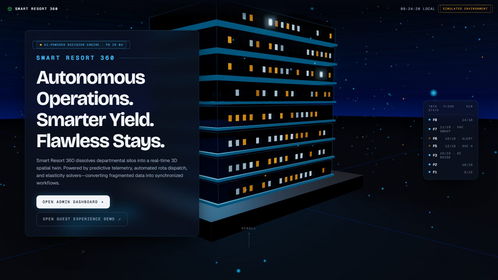
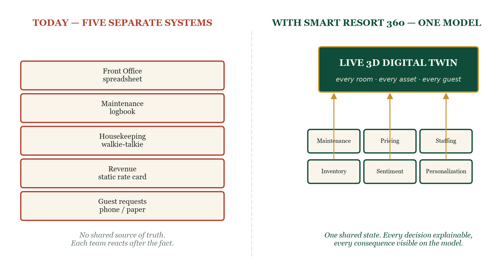
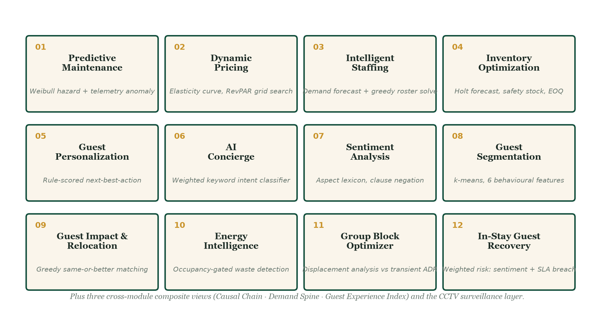
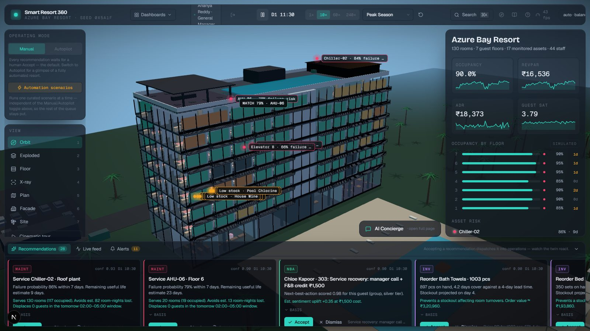
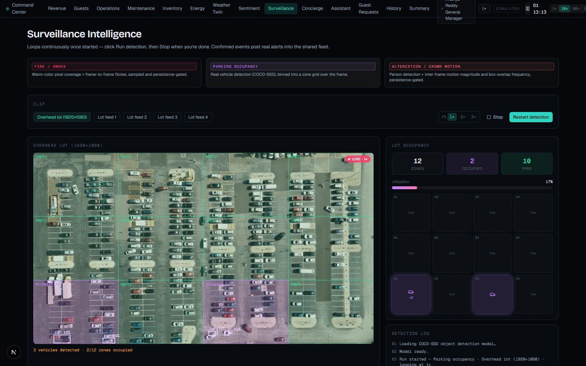
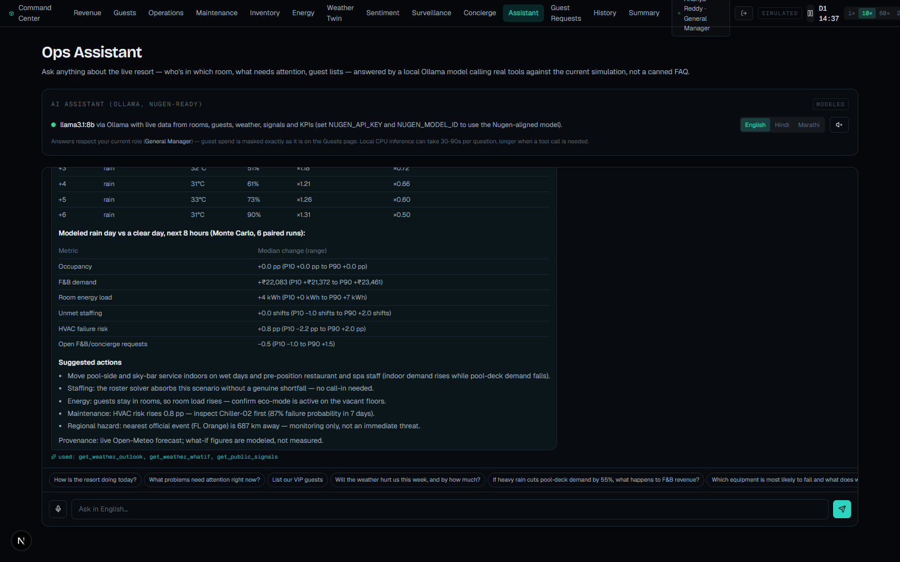
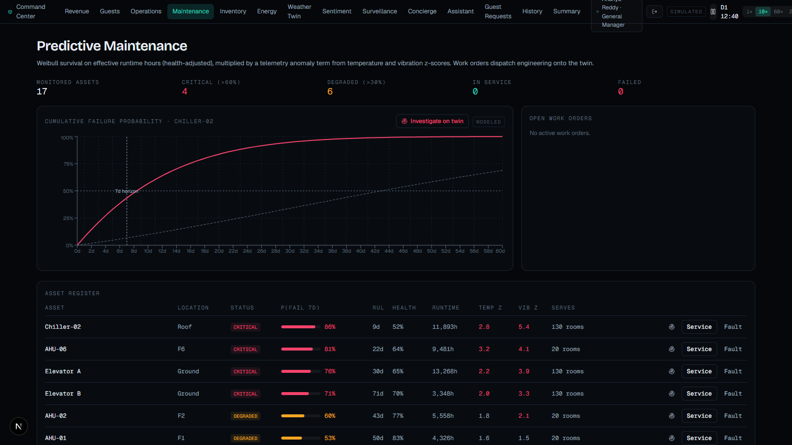
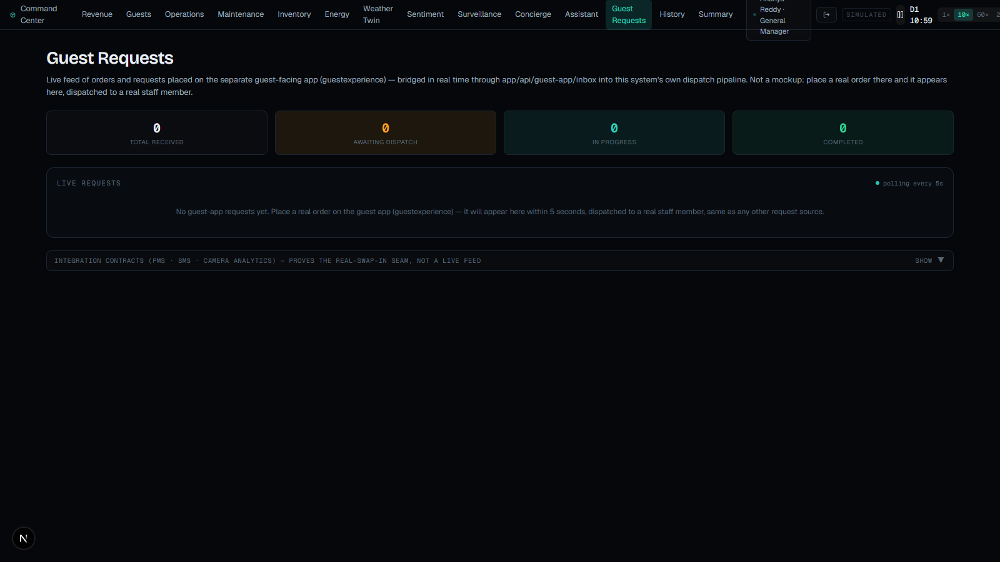
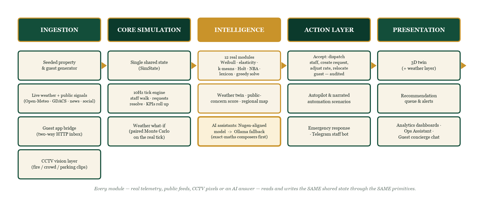
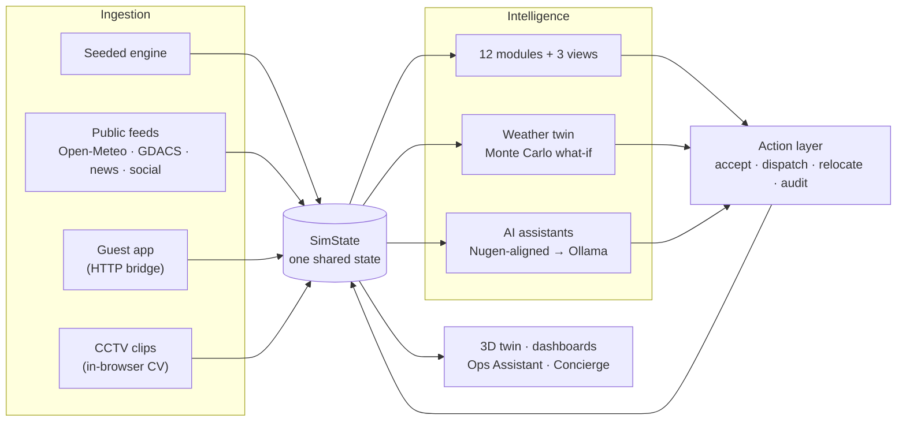

<div align="center">

# Smart Resort 360

### One live, explainable 3D digital twin of a resort — twelve decision-science modules, real CCTV vision, weather-aware what-if simulation, and domain-aligned AI assistants (Nugen Intelligence).

[](https://github.com/vizsh/Pillai_Hotel360/actions/workflows/ci.yml)


**HackCelestial 3.0 · Pillai University · Problem Statement 04 — AI-powered resort operations, guest experience, revenue and safety**

[Quick start](#quick-start) · [What it does](#what-it-does) · [Architecture](#architecture) · [AI layer](#ai-layer-nugen-intelligence--ollama-fallback) · [Docs](#documentation) · [Honest scope](#what-is-real-modeled-and-simulated)

</div>

<p align="center"></p>

---

## The problem

A resort runs on five departments that each keep their own record of the truth — front office on a spreadsheet, maintenance on a logbook, housekeeping on a walkie-talkie, revenue on a static rate card, guest requests on a phone call. None talk to each other in real time and none explain *why* a decision was made. The result is a property that is permanently **reacting**: to a complaint after checkout, to a failure after it happens, to a rate that should have moved three days ago, to a storm everyone read about but nobody planned for.

## The idea

Give every department — and the guest — **one shared, spatial, explainable model of the property**, and make every decision module read from and write to that same model.

<p align="center"></p>

Every recommendation carries the *measured inputs* that produced it (a Weibull hazard, an elasticity delta, a warm-pixel ratio) — never a bare confidence score. Accepting one **dispatches a real consequence** you can watch on the twin.

## What it does

| | Capability | Where it lives |
|---|---|---|
| **12 decision modules** | Predictive maintenance (Weibull), dynamic pricing (elasticity), staffing (greedy + swap), inventory (Holt/EOQ), sentiment, segmentation (k-means), personalization, concierge, guest relocation, energy, group blocks, in-stay recovery | [`lib/intelligence`](lib/intelligence) · [math](docs/INTELLIGENCE_MODELS.md) |
| **3 composite views** | Causal chain, 14-day demand spine, Guest Experience Index | `lib/intelligence` |
| **Weather-aware digital twin** | Live forecast drives the simulation; Monte Carlo what-if on the *real* tick engine; **online Bayesian calibration** (the twin keeps learning); **cascade graph** of 1st/2nd/3rd-order effects; plain-English scenarios; regional map with radar and hazard events | [`/weather-twin`](app/weather-twin) · [docs](docs/WEATHER_AND_SIGNALS.md) |
| **Public-signal intelligence** | 7 live sources → concern score, plus **traveller-impact reading** of each post (cancellation, disruption, flooding, safety…) by the Nugen-aligned model with a rules fallback | [`app/api/social-weather-signals`](app/api/social-weather-signals) |
| **CCTV vision layer** | Fire, altercation/distress, parking occupancy — real in-browser detection over bundled test clips, persistence-gated | [`lib/vision`](lib/vision) · [docs](docs/SURVEILLANCE.md) |
| **AI assistants** | Ops Assistant + guest Concierge on a **Nugen-aligned model with automatic Ollama fallback**; exact-maths composers; grounding gate | [`lib/ai`](lib/ai) · [docs](docs/AI_ASSISTANTS.md) |
| **Automation** | Autopilot (same `accept()` as a manual click), 15 narrated scenarios, emergency response, Telegram staff bot | [docs](docs/AUTOMATION_AND_INTEGRATIONS.md) |
| **Guest side** | Two-way bridge to the separate guest companion app, registration QR, live Guest Requests view | [`app/api/guest-app`](app/api/guest-app) |
| **Governance** | Role-based login (4 roles), salted scrypt hashes, signed sessions, SQLite audit log, guest-consent masking | [`lib/auth`](lib/auth) · [`lib/db`](lib/db) |

<p align="center"></p>

## See it

<table>
<tr>
<td width="50%"><br><sub><b>Command center</b> — live 3D twin, asset-risk pins, KPIs, and a recommendation queue where every card shows its basis.</sub></td>
<td width="50%"><br><sub><b>Weather digital twin</b> — live 7-day forecast, regional map with radar, and the Monte Carlo what-if.</sub></td>
</tr>
<tr>
<td width="50%"><br><sub><b>CCTV vision</b> — COCO-SSD vehicle detection binned into a 12-zone grid, running in the browser on bundled footage.</sub></td>
<td width="50%"><br><sub><b>Ops Assistant</b> — a templated storm briefing: forecast, modeled bands, actions, and the tools used.</sub></td>
</tr>
<tr>
<td width="50%"><br><sub><b>Predictive maintenance</b> — Weibull hazard × telemetry anomaly, with the measured basis on every card.</sub></td>
<td width="50%"><br><sub><b>Guest bridge</b> — orders placed in the companion app land here live and dispatch real staff.</sub></td>
</tr>
</table>

## Design principles

1. **Explainable by construction** — every recommendation shows its measured basis.
2. **Persistence-gated everywhere a signal is noisy** — one spike never becomes an alert (maintenance, sentiment, CCTV alike).
3. **Numbers come from code, not from a language model** — AI answers are handed facts; arithmetic is computed; unverified figures are flagged.
4. **Honest about what is real** — every value is tagged `SIMULATED`, `MODELED` or `DERIVED`; every external feed shows live / unreachable individually.
5. **A visible off-ramp for automation** — Autopilot and scenarios execute the same functions a human click does, and can be stopped any time.
6. **Graceful degradation** — a blocked API, a missing key or an offline network degrades one feature, never the app.

## Architecture

<p align="center"></p>



The simulation mutates one state object at 10 Hz; the 3D layer reads it inside `useFrame`, so React never re-renders per tick. Geometry is procedural (no model files), merged and instanced to roughly 90 draw calls. Full detail: [`docs/ARCHITECTURE.md`](docs/ARCHITECTURE.md).

## AI layer: Nugen Intelligence + Ollama fallback

The requirement is a chain, not an API call — **base model → Nugen alignment → domain model → integrated inference** — and that is exactly what is built and scripted.

<p align="center"></p>

```bash
npm run nugen:corpus      # build the 19-file domain corpus (docs, knowledge bases, engine-generated exemplars, style guides)
npm run nugen:align       # upload → benchmark → align base model → deploy → writes NUGEN_MODEL_ID to .env.local
npm run nugen:status      # progress + account models
npm run nugen:chat        # base vs aligned answers, side by side
```

The same aligned model does four jobs — Ops Assistant, guest Concierge, reading public posts for the weather twin, and turning plain-English scenarios into what-if parameters. With no model reachable at all (a deployment without Ollama or a key), the assistants still answer from live data with templates.

At runtime **both assistants** (staff Ops Assistant and the guest Concierge) share one provider chain — Nugen-aligned model first, local Ollama automatically on any error, and the guest Concierge has a final offline answer — and every reply shows which provider produced it.

What makes the answers trustworthy rather than merely fluent:

- **Exact-maths composers** answer savings, commission, zone-shock, weather-briefing and equipment questions from measured numbers with *no model at all*.
- **Deterministic routing** pre-fetches the live data a question needs and injects it into the prompt.
- **Grounding gate** — any figure ≥ 1,000 in a reply must appear in the data the model was given (±0.6 %); otherwise one rewrite, then a visible caveat.
- **Guardrails** block promises of refunds, discounts or compensation.

Details: [`docs/AI_ASSISTANTS.md`](docs/AI_ASSISTANTS.md) · [`docs/NUGEN_INTEGRATION.md`](docs/NUGEN_INTEGRATION.md) (includes current alignment status).

## Quick start

Requires **Node ≥ 22.5** (built-in `node:sqlite`).

```bash
npm install
npm run dev            # http://localhost:3000  (landing page)  →  Open Admin Dashboard
```

Sign in with a one-click demo role (General Manager, Revenue Manager, Front Office Manager, Executive Housekeeper). Then:

| Try this | Route |
|---|---|
| The 3D twin, recommendation queue, Autopilot, "What if…", "Weather what if…" | `/command` |
| Run CCTV detection on fire / parking / behaviour clips | `/surveillance` |
| Weather twin, regional map, public signals | `/weather-twin` |
| Ask the Ops Assistant (try the prompts below) | `/assistant` |
| Live guest requests arriving from the guest app | `/integrations` |

Optional services (everything works without them): `ollama pull llama3.1:8b` and `ollama pull nomic-embed-text` for the local fallback; `NUGEN_API_KEY` / `NUGEN_MODEL_ID` in `.env.local` for the aligned model (copy `.env.example`); `NEWS_API_KEY` / `GNEWS_API_KEY` for two of the seven signal sources; a Telegram bot token for the staff bot. See the [feature guide](docs/FEATURE_GUIDE.md).

### Prompts that show the assistant off

> *We spend about ₹8 lakh a month on chiller repairs. If predictive maintenance cuts unplanned-failure cost by 20 to 40%, what do we save a year?* — exact working table

> *A cyclone hits Goa this weekend. How should we prepare and what does the model say happens?* — forecast table, Monte Carlo bands, actions

> *Suppose heavy rain cuts pool-deck demand by 55%. How much daily revenue is at risk?* — outlet-scoped answer, honest about untracked revenue

> *Which equipment should engineering service first, and why is waiting expensive?* — ranked risk, 3–5× reactive-cost benchmark

> *Which APIs does this system integrate and what is each used for?* · *How does the CCTV fire detection avoid false alarms?*

## Quality

```bash
npm run lint && npx tsc --noEmit && npm test && npm run build     # what CI runs
npx tsx scripts/smoke.ts                                          # headless multi-day simulation, prints KPIs
```

270+ tests cover every intelligence module, the simulation engine, auth and RBAC, the AI tool layer, the exact-maths composers, the Nugen provider chain (mocked transport) and the numeric grounding gate.

## What is real, modeled and simulated

| Status | Meaning |
|---|---|
| **Real** | Running, verified code: the twin, all module maths, CCTV detection on bundled clips, live weather, the what-if engine, the regional map, each public feed individually, the Telegram bot, the two-way guest bridge, RBAC, the assistant provider chain. |
| **Modeled** | A real formula applied to simulated state — a hazard %, a next-best-action score, a what-if percentile band. |
| **Simulated** | The property, guests, staff and telemetry come from a seeded deterministic engine. No real guest data exists or is implied. |

PMS / BMS / camera-analytics are proven as payload contracts only. Nugen alignment is scripted and verified against the live API; at the time of writing Nugen's training service was returning HTTP 502, so the assistants run on the Ollama fallback until an aligned model deploys ([status](docs/NUGEN_INTEGRATION.md#status)). Business-impact figures are modeled projections, never measurements.

## Project layout

```
app/                Next.js routes: /command, analytics pages, /surveillance, /weather-twin, /assistant, API routes
components/         twin (R3F scene), command center, analytics, UI primitives
lib/sim/            seeded population, 10 Hz tick engine, A* staff pathing, actions, scenario catalogue
lib/intelligence/   12 decision modules, 3 composite views, weather twin, social signals, what-if
lib/vision/         CCTV: COCO-SSD parking, calibrated fire/altercation heuristics, persistence gate
lib/ai/             provider chain (Nugen → Ollama), tools, composers, grounding gate, knowledge base
lib/auth · lib/db   scrypt hashes, signed sessions, RBAC · SQLite audit log and snapshots
scripts/nugen/      corpus builder + alignment pipeline (upload → benchmark → align → deploy → chat)
scripts/            smoke test, Telegram bot
public/surveillance bundled demo footage (10 clips) so detection runs on any deployment
docs/               architecture, models, surveillance, automation, AI, Nugen, API catalogue, problems solved
tests/              270+ vitest tests
```

## Documentation

| Doc | Covers |
|---|---|
| [ARCHITECTURE](docs/ARCHITECTURE.md) | System diagrams, data flow, state and rendering model |
| [INTELLIGENCE_MODELS](docs/INTELLIGENCE_MODELS.md) | The maths behind every module |
| [AI_ASSISTANTS](docs/AI_ASSISTANTS.md) | Provider chain, tools, composers, routing, grounding gate |
| [NUGEN_INTEGRATION](docs/NUGEN_INTEGRATION.md) | Alignment pipeline, corpus, runtime flow, env vars, status |
| [WEATHER_AND_SIGNALS](docs/WEATHER_AND_SIGNALS.md) | Weather twin, Monte Carlo what-if, public-signal score, regional map |
| [API_CATALOG](docs/API_CATALOG.md) | Every external API and internal route, with use case and failure behaviour |
| [SURVEILLANCE](docs/SURVEILLANCE.md) | CCTV layer and how thresholds were calibrated |
| [AUTOMATION_AND_INTEGRATIONS](docs/AUTOMATION_AND_INTEGRATIONS.md) | Autopilot, scenarios, Telegram, guest bridge |
| [FEATURE_GUIDE](docs/FEATURE_GUIDE.md) | Detailed setup, per-feature behaviour, keyboard shortcuts, known limitations |
| [PROBLEMS_AND_SOLUTIONS](docs/PROBLEMS_AND_SOLUTIONS.md) | Real bugs, root causes, fixes |
| [DIFFERENTIATORS](docs/DIFFERENTIATORS.md) | What to check as a reviewer, and where it is demonstrated |

## Limitations

Sentiment is lexicon-based; pricing blends elasticity by guest mix rather than estimating per channel; CCTV fire and altercation detectors are calibrated heuristics, not trained classifiers; public-signal scoring is a coarse keyword-and-hazard blend and some sources may be unreachable from a given network; the what-if band uses six independent runs; weather and map coordinates are fixed to Goa as a stand-in property. The full list is in the [feature guide](docs/FEATURE_GUIDE.md#limitations).

---

<div align="center"><sub>Built for HackCelestial 3.0 at Pillai University. Companion guest app: <a href="https://github.com/SDP42/guestexperience">SDP42/guestexperience</a>.</sub></div>
