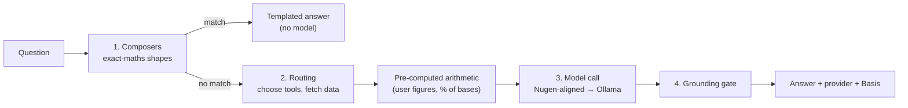

# AI Assistants: Composers, Routing and the Grounding Gate

Smart Resort 360 has two conversational assistants:

| Assistant | Audience | Where | Grounding |
|---|---|---|---|
| **Ops Assistant** | GM, Revenue, Front Office, Housekeeping | `/assistant` · `app/api/ops-assistant` | Live simulation snapshot + system knowledge |
| **Guest Concierge** | A guest on their phone | Companion app (separate repo) · `/concierge` here | Resort knowledge base (RAG); tasks dispatched deterministically |

Both use one provider chain — **Nugen-aligned model → Ollama fallback** (see [NUGEN_INTEGRATION.md](NUGEN_INTEGRATION.md)) — and both follow one rule: **the model explains and reasons over facts it is handed; it never supplies the numbers.**

## Pipeline for an ops question



### 1 · Deterministic composers — [`lib/ai/composers.ts`](../lib/ai/composers.ts)

Question shapes where a language model cannot be trusted with arithmetic are answered from measured numbers, with a working table, instantly and offline:

| Composer | Example | Behaviour |
|---|---|---|
| User figures | "₹8 lakh a month… cut 20 to 40%… a year?" | Parses ₹/lakh/crore, periods and percentage ranges; annualises; shows low/high cases |
| Commission | "…what would it be at a 25% OTA rate?" | Re-prices direct-booked revenue at the asked rate against the model's 20% |
| Zone shock | "Rain cuts pool-deck demand by 55%…" | Applies the % to *that outlet only*, states outlet revenue is untracked, uses the model's indoor pick-up, labels the ₹ base illustrative |
| Weather briefing | "A cyclone hits Goa… how do we prepare?" | Forecast table + Monte Carlo bands + rule-based actions + hazard distance |
| Equipment | "Which equipment should engineering service first?" | Ranked P(fail ≤ 7 d), remaining life, 3–5× reactive-cost benchmark |

### 2 · Routing and tools — [`lib/ai/tools.ts`](../lib/ai/tools.ts)

`routeTools()` maps a question to the tools that answer it and the results are injected into the prompt, so any model reads facts instead of having to pick tools:

`find_room` · `list_open_issues` · `list_guests` · `list_planned_actions` · `get_resort_summary` · `get_financials` · `get_weather_outlook` · `get_weather_whatif` · `get_public_signals` · `get_asset_risk` · `calculate` (a small recursive-descent evaluator, no `eval`) · `search_knowledge` (keyword-ranked system facts: methods, formulas, every API).

`precomputeMoney()` and `precomputeUserMath()` add verified "quote these" arithmetic lines. The model may still call tools itself when routing finds nothing.

### 3 · The grounding gate — `ungroundedFigures()`

```
every figure x ≥ 1,000 in the reply must satisfy |x − y| / y < 0.6 %
for some y in ( tool data ∪ user message ∪ verified arithmetic )
```

A reply that fails gets one rewrite naming the offending figures; if it still fails, a visible note says the figure could not be verified. The **Basis** line is written by the server from the tools actually used — the model cannot claim a tool it did not call. Guardrails additionally block promises of refunds, discounts or compensation.

## Snapshot and privacy

The simulation lives in the browser, so the client builds a per-question snapshot ([`lib/ai/opsSnapshot.ts`](../lib/ai/opsSnapshot.ts)): rooms, guests, requests, alerts, recommendations, financials, 7-day forecast with demand profile, public signals (with hazard distance from the resort), top assets by failure risk, and — only for weather-related questions — a computed Monte Carlo what-if. Guest spend is masked by role and by guest consent, exactly as on the Guests page.

## Prompt rules worth knowing

`lib/ai/opsAssistantPrompt.ts` encodes: lead with a bold answer, then a table, then a next step; show maths as Formula → Substitution → Result in Indian digit grouping; never apply a zone's percentage to total revenue; label figures live / modeled / simulated; treat a hazard beyond 500 km as monitoring only; never invent workings; answer only the latest question.

## Guest concierge

The companion app's pipeline (language detection → safety keywords → live weather → food-order parsing → rules → trained intent model → semantic router → RAG) keeps **task dispatch deterministic**; the model only writes the knowledge answer, from numbered context, in the guest's language, and answers "I don't have that — dial 0" rather than guess.

## Tests

`tests/ai/` covers the tools, the calculator, routing hints, knowledge search, every composer, the user-figure parser, the grounding gate and the provider chain (mocked transport). Run `npm test`.
