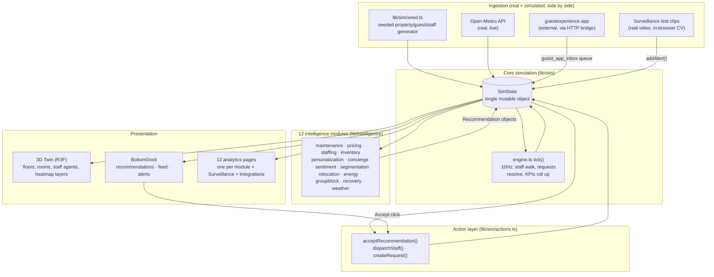
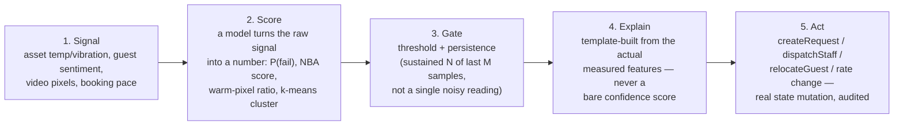

# System Architecture

Smart Resort 360 is a single Next.js app with three things layered on top of one shared state object: a **3D digital twin**, a **deterministic simulation engine**, and **12 real intelligence modules**. Everything else in the project — the CCTV vision layer, the guest-facing app bridge, the Telegram bot, Autopilot, Automation Scenarios — is a consumer or producer of that one state object. There is no hidden second source of truth.

## 1. The shape of the system



**The one rule that makes this tractable:** every module — pricing, staffing, the CCTV fire detector, the guest-app bridge — reads and writes the *same* `SimState` object through the *same* handful of primitives (`createRequest`, `addAlert`, `pushFeed`, `dispatchStaff`, `acceptRecommendation`). A recommendation from the predictive-maintenance module and an alert from the fire-detection heuristic land in the identical `state.alerts` map and show up in the identical `BottomDock` list. Nothing is a separate demo bolted on the side.

## 2. Data flow: from signal to consequence

Every intelligence module — real telemetry or CCTV pixels — follows the same five-stage path:



This is the same pipeline whether the "signal" is a chiller's runtime hours or a CCTV frame's warm-pixel ratio — see [`INTELLIGENCE_MODELS.md`](INTELLIGENCE_MODELS.md) for the math at stage 2 and [`SURVEILLANCE.md`](SURVEILLANCE.md) for how stage 3 (the persistence gate) was calibrated against real footage.

## 3. Folder map

```
lib/architecture   parametric resort generator (config → rooms, zones, assets, nav graph)
lib/sim            entity types, seeded population, tick engine, A* pathfinding, actions,
                    scenarioCatalog.ts (Automation Scenarios)
lib/intelligence   the 12 modules + registry + 3 cross-module composite views
                    (causalChain, demandSpine, guestExperience)
lib/vision         the CCTV surveillance layer: coco.ts (real object detection),
                    fireHeuristic.ts / altercationHeuristic.ts (calibrated pixel/motion
                    heuristics), parkingGrid.ts, persistence.ts (the confirmation gate)
lib/integration    the guestexperience guest-app bridge adapter + real seed-data mapping
lib/adapters       PMS/BMS/camera-analytics payload contracts — proves the simulated
                    SimState shape is what a real integration would actually send
lib/twin           layer colour maps, merged geometry builders, materials, "show me" queries
lib/ai             opt-in Ollama-backed concierge (RAG) + ops assistant (tool calling)
store              zustand: sim (transient, 10Hz), twin view state, ui, director, session
components/twin    R3F scene: floors, facade, room plates, furniture, site, staff agents
components/command command center shell, BottomDock, AutomationScenariosPanel, LeftRail
components/analytics  12 module deep-dive pages + Surveillance + Integrations + GuestsPage's
                    QR card + GuestPhoneMock (guest-side view mirror)
app/api            weather proxy, telegram inbox, guest-app inbox, actions audit log, auth
```

## 4. State and rendering

- **The sim never re-renders React.** `useSim`'s `mutate()` writes directly into one plain object at up to 10Hz; the 3D layer reads it inside `useFrame` (outside React's render cycle entirely), and UI panels subscribe to a throttled `version` counter so they re-render on meaningful change, not on every tick.
- **Geometry is procedural, not modeled.** `lib/architecture/config.ts` parametrizes floors, rooms per side, dimensions, roof and site; walls are merged per floor and furniture/room plates are instanced, so the entire resort renders in roughly 90 draw calls regardless of room count.
- **Quality tiers** (`store/quality.ts`) auto-degrade DPR, shadows, post-processing and palm density on sustained low FPS — the twin stays interactive on modest hardware instead of silently janking.

## 5. The CCTV vision layer's place in this architecture

The surveillance layer (`/surveillance`, `lib/vision/*`) is not a separate app bolted on — it produces the exact same `Alert` objects (`addAlert()`) every other module produces, which is why a fire confirmed by pixel analysis shows up in the same `BottomDock` alerts tab as a maintenance alert from asset telemetry. See [`SURVEILLANCE.md`](SURVEILLANCE.md) for the full detection pipeline and how each heuristic's thresholds were calibrated against real measured pixel values from the provided test footage (not guessed).

## 6. External integrations: what's real vs. simulated at the boundary

| Integration | Status | Where |
|---|---|---|
| Weather | **Real, live** — Open-Meteo, no key, cached 20min server-side | `app/api/weather`, `hooks/useLiveWeather.ts` |
| Telegram frontline bot | **Real** — long-polling bot process, bridges via a SQLite queue | `scripts/telegramBot.ts`, `hooks/useTelegramInbox.ts` |
| guestexperience guest app | **Real bridge, one-way today** — a real HTTP inbox + adapter; the guest app itself doesn't call it yet (documented, not hidden) | `app/api/guest-app/inbox`, `lib/integration/guestAppAdapter.ts` |
| CCTV surveillance | **Real detection, real test footage** — in-browser inference over your own supplied clips, not staged screenshots | `lib/vision/*`, `app/surveillance` |
| PMS / BMS / Camera analytics | **Contract only, honestly labeled as such** — `lib/adapters` proves the exact payload shape a real system would send, generated live from current state | `components/analytics/IntegrationsPage.tsx` |

See [`AUTOMATION_AND_INTEGRATIONS.md`](AUTOMATION_AND_INTEGRATIONS.md) for how each of these actually works end to end.
