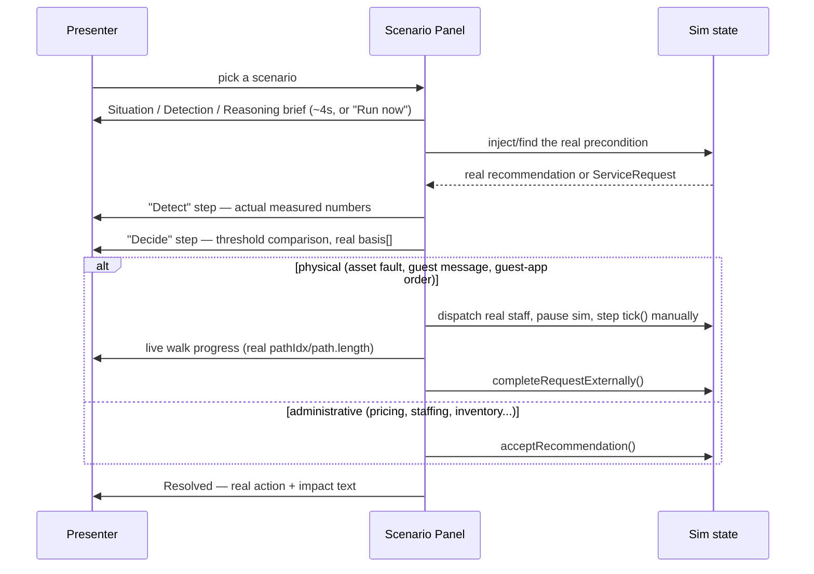
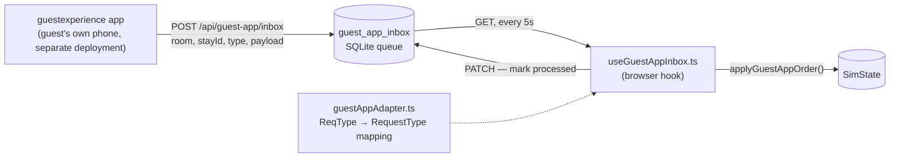

# Automation and Integrations

How this project demonstrates "what if this ran itself" and how it actually talks to the outside world — three distinct automation surfaces, and four real integration seams.

## 1. Autopilot — the blanket demo mode

`store/ui.ts`, `components/command/BottomDock.tsx`

`Operating mode` in the left rail switches **Manual** (default — every recommendation waits for a human Accept) to **Autopilot**: every *currently pending* recommendation counts down 6 seconds, visibly, then calls the exact same `acceptRecommendation()` a manual click uses. Not a scripted sequence — real execution, with a countdown a judge can watch, and switching back to Manual mid-countdown cancels every pending timer immediately.

## 2. Automation Scenarios — one curated situation at a time, fully narrated

`lib/sim/scenarioCatalog.ts`, `components/command/AutomationScenariosPanel.tsx`

Autopilot's limitation: it only ever acts on whatever *already happens* to be pending, and shows no procedure — just an instant accept. Automation Scenarios fixes both problems with 15 scenarios, one per real module (plus the guest-app bridge and live chat), each independent of the Manual/Autopilot toggle so triggering a demo doesn't also set the whole queue auto-executing:

Two reliability techniques, both grounded in real logic rather than fabricated outcomes:
- **Forced triggers** for scenarios needing a specific precondition (e.g. `triggerPersonalizationVip` nudges a guest's real preference field, then *verifies* via the real `nextBestActions()` scoring that it actually becomes that guest's top-ranked, resort-wide-top-3 action before committing — not just eligible).
- **Honest clock-advance retries** for population-level modules with no live match at the instant they're picked (`tickForwardStep` — the real `tick()` function, stepped and re-checked, not a fake wait).

## 3. Telegram frontline bot — real, standalone process

`scripts/telegramBot.ts`, `hooks/useTelegramInbox.ts`

A real bot (long-polling, no webhook/public URL needed) lets housekeeping/engineering/front-desk staff receive tasks and report issues from their own phone. Because the simulation only ever lives inside a browser tab, the bot bridges through the same SQLite database the app already persists (`telegram_inbox` queue table); a hook in the running browser polls every 6s and applies each action through the identical `lib/sim/actions.ts` functions any dashboard button uses.

## 4. The guestexperience guest-app bridge — the newest integration

`app/api/guest-app/inbox`, `lib/integration/guestAppAdapter.ts`, `hooks/useGuestAppInbox.ts`

A separate, independently-deployed guest-facing app (`github.com/SDP42/guestexperience`) has no shared database with this one — building the bridge honestly meant an HTTP inbox, following the exact same architecture already proven for the Telegram bot (external caller → SQLite queue → browser-polling hook → real action functions), not a fictional "shared DB":

The type mapping (`room_service→fnb`, `sos→complaint`, etc.) is a real translation layer, not a pass-through — guestexperience's own request vocabulary differs from this project's `RequestType`. Verified live end-to-end: a POSTed order was drained and dispatched to real staff within one poll cycle.

**Honest scope note:** guestexperience itself doesn't call this endpoint yet — the bridge is built and proven from this side; wiring the other app to actually POST here is explicit future work, stated as such rather than implied as already connected.

### The registration QR code

`components/analytics/GuestAppQrCard.tsx`, `lib/integration/guestExperienceStays.ts`

Generates a real, scannable QR linking to `guestexperience.vercel.app/room/{room}?stay={stayId}` — using a **real** `(room, stay_id, guest_name)` triple pulled directly from guestexperience's own public seed data (fetched from its repo, not invented), so scanning it against the live deployment resolves to that guest's actual personalized page.

## 5. Weather — the one fully-live external data source

`app/api/weather`, `hooks/useLiveWeather.ts`, `lib/intelligence/weather.ts`

Every other module names its real-world swap-in as future work. Weather is that swap, built for real: Open-Meteo (no API key, CORS-open), cached 20 minutes server-side, polled automatically — `lib/intelligence/weather.ts` prefers the live forecast the instant it arrives and falls back to the deterministic seeded one otherwise, with the *playbook logic* itself unchanged either way. The Operations page labels which source is currently live, honestly, instead of presenting both identically.

## 6. Integrations page — proving the production seam, not just describing it

`components/analytics/IntegrationsPage.tsx`, `lib/adapters/*`

Every module in this app reads one internal shape, `SimState`, written today by a seeded simulator. `lib/adapters/simulatedSource.ts` maps the *current, live* simulation into the exact payload shapes a real **PMS** (Oracle Opera Cloud / Protel / Cloudbeds), **BMS** (Honeywell / Siemens Desigo / BACnet), or **camera analytics** system (Verkada / Density / Xovis — the same category of system the Surveillance page's own detections are a concrete, working instance of) would actually send. The JSON shown on that page is generated live, not a static mockup — it's the proof that the contract is satisfiable with real data, not aspirational.
