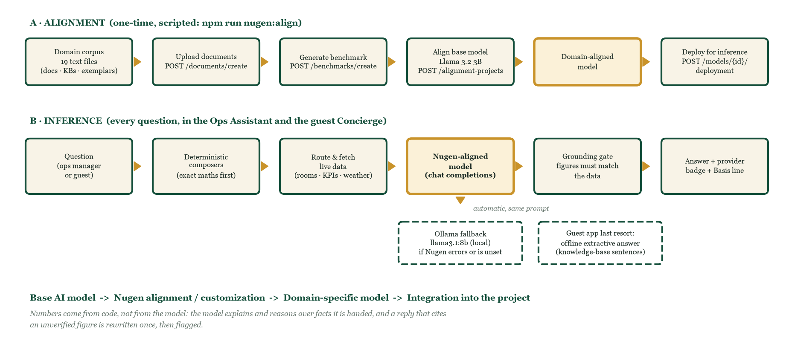
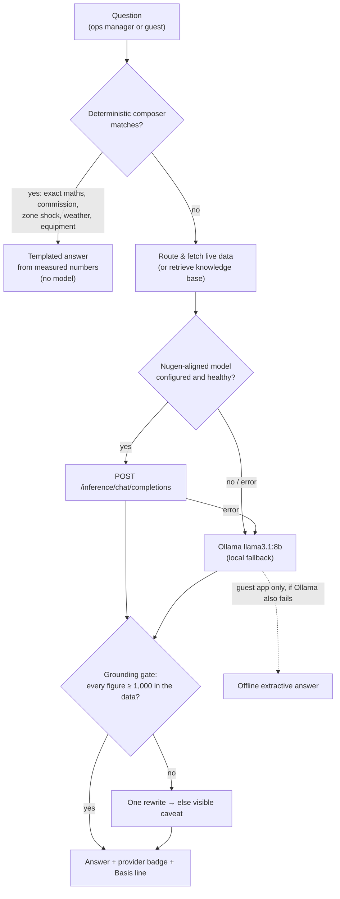

# Nugen Intelligence Integration

> **Requirement (HackCelestial 3.0, Additional Task 2):** *Base AI model → Nugen alignment/customization → domain-specific model → integration into the project, used for inference.* A generic model or a basic API call does not satisfy it.

This document explains what was built for that chain, how to run it, how it behaves at runtime, and — honestly — where it stands today.



## 1. What is aligned, and on what

The base model is customised on a **19-file domain corpus** built directly from the project itself (`npm run nugen:corpus` → `nugen/corpus/`, plain text because Nugen's developer edition accepts text only):

| Source | Files | Purpose |
|---|---|---|
| Project docs (`docs/*.md`) | 6 | Architecture, module mathematics, surveillance, automation and integrations, differentiators, problems solved |
| System knowledge (Q&A) | 1 | Curated how-it-works, formula and API facts as question/answer pairs (`lib/ai/systemKnowledge.ts`) |
| Resort knowledge base | 1 | Guest-facing facts: room types, loyalty tiers, segments, privacy (`lib/ai/knowledge.ts`) |
| Guest app knowledge base | 8 | Dining, FAQ, local area, policies, rooms, safety, spa, sustainability (from the companion app) |
| Exemplar answers | 1 | Answers in the house format produced by the **real deterministic engine**, so style is taught from correct numbers |
| Style guides | 2 | Ops-assistant and guest-concierge rules: honesty labels, no invented figures, no refund promises, safety first, language matching |

## 2. The alignment pipeline (scripted and resumable)

```bash
cp .env.example .env.local        # add NUGEN_API_KEY
npm run nugen:corpus              # build the corpus
npm run nugen:align               # the whole chain below; resumes from nugen/state.json
npm run nugen:status              # progress, alignment/deployment state, account models
npm run nugen:chat -- "question"  # base vs aligned answers side by side
```

| Step | Nugen endpoint | Notes |
|---|---|---|
| Upload | `POST /api/v3/documents/create` | multipart text; each document polled to `READY` |
| Benchmark | `POST /api/v3/benchmarks/create` | 30 evaluation samples generated from the same documents |
| Align | `POST /api/v3/alignment-projects/create` | `base_model_id` chosen from `GET /api/v3/models/base` (alignment-ready, no access request) or `--base`; polled `QUEUED → PROCESSING → READY` |
| Locate model | `GET /api/v3/alignment-projects/{id}` / `GET /api/v3/models/aligned` | reads the aligned `model_id` |
| Deploy | `POST /api/v3/models/{id}/deployment` | 5–15 min; polled to `DEPLOYED`; `NUGEN_MODEL_ID` written to `.env.local` |
| Infer | `POST /api/v3/inference/chat/completions` | called by both assistants |

Code: [`scripts/nugen/`](../scripts/nugen) (`build-corpus.ts`, `client.ts`, `align.ts`, `status.ts`, `chat.ts`).

## 3. Runtime flow

Both the **Ops Assistant** (staff) and the **guest Concierge** call one provider chain:



Implementation:

- **Ops side** — [`lib/ai/llm.ts`](../lib/ai/llm.ts) (`llmChat`, `llmStatus`), [`app/api/ops-assistant/route.ts`](../app/api/ops-assistant/route.ts), [`app/api/concierge/route.ts`](../app/api/concierge/route.ts). Nugen's chat schema only knows `system/user/assistant`, so tool results are folded into user turns; `<think>` blocks from reasoning models are stripped; a 60-second circuit breaker prevents repeated timeouts before falling back.
- **Guest side** (companion app, separate repo) — `lib/llm.ts` in [`SDP42/guestexperience`](https://github.com/SDP42/guestexperience): Nugen → Ollama → optional Anthropic → offline extractive answer; the answer trace shows the provider.
- **Visibility** — `GET /api/ops-assistant` and `GET /api/concierge` report `provider: "nugen" | "ollama" | "none"`, and the UI badge reads "Nugen-aligned" or "Ollama (fallback)".

## 4. Why this design

- **Domain fluency** — the model learns this system's vocabulary (Weibull hazard, elasticity, TRevPAR, persistence gating) and answer style.
- **Trust** — numbers come from code, not the model. Alignment improves language; composers and the grounding gate protect figures. See [AI_ASSISTANTS.md](AI_ASSISTANTS.md).
- **Resilience** — a missing key, an outage or a network drop degrades to a local model, never a dead chatbot.
- **One model, two audiences** — the same aligned model serves operations and guests, each steered by its own style guide and data.
- **Privacy** — only the data a question needs is sent; deterministic answers never leave the machine.

## 5. Tests

`tests/ai/llm.test.ts` verifies, with a mocked transport: Nugen is used when configured and reported as the provider; requests hit `/api/v3/inference/chat/completions` with the Bearer key and aligned model id; tool calls whose arguments arrive as JSON strings are parsed; tool results are folded into user turns. The fallback path was verified against a local Ollama and a mock Nugen server that rejects a wrong key.

## Status

| Item | State |
|---|---|
| Account and API key | Verified live |
| Corpus | 19 documents uploaded and processed |
| Benchmark | Generated (30 samples) |
| Base models | `llama-v3p2-3b-reasoning` (3B) and `qwen-v2p5-0p5b-instruct` (0.5B) are alignment-ready on the account |
| Alignment training | Submitted several times on both base models; Nugen's training service returned **HTTP 502** on job creation each time |
| Runtime today | Both assistants answer through the **Ollama fallback**; setting `NUGEN_MODEL_ID` switches them to the aligned model on the next request, no code change |

The pipeline is resumable, so a successful run needs only `npm run nugen:align`.
