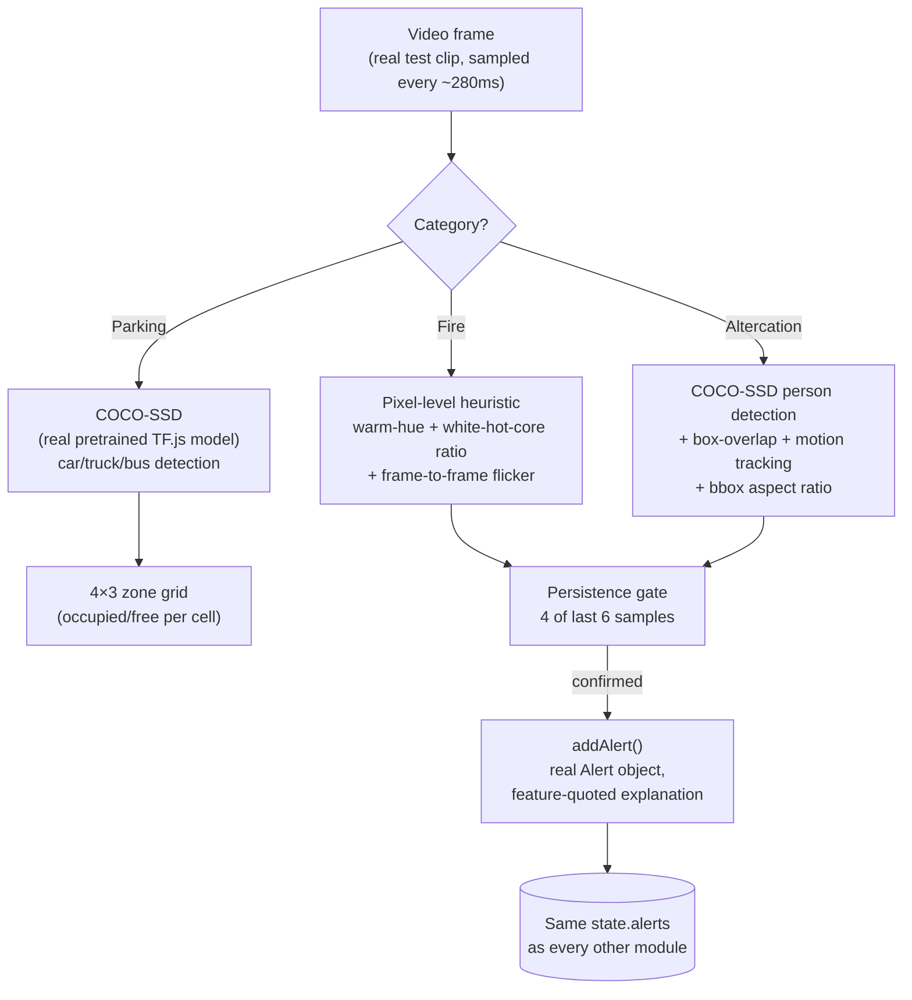

# CCTV Surveillance Intelligence — "the eyes of the resort"

`/surveillance`, `lib/vision/*`. Real, in-browser computer vision over real user-supplied test footage (`public/surveillance/`, gitignored — not fabricated screenshots), demonstrating the same detect → decide → act loop as every other module in this project, applied to fire/smoke, altercations, and parking occupancy.

## Why this isn't a trained model, and why that's the honest choice

There is no small, off-the-shelf pretrained classifier for "fire" or "fight" the way there is for "car" or "person" — training one needs a labeled dataset and a training pipeline this project doesn't have. The choice was between **pretending** a bespoke model exists (a fabricated confidence score) or reading the **real, documented visual/motion signatures** those events actually produce, directly off the pixels, with every number in an alert traceable to a measured feature. This project's whole design language already treats a bare confidence score as insufficient — the vision layer holds the exact same bar.



## The persistence gate — the one rule that keeps this trustworthy

`lib/vision/persistence.ts`: a signal must cross its threshold on **4 of the last 6 samples** (at ~280ms/sample, ≈1.7s) before it counts as a confirmed event. This is the single biggest lesson from any CCTV-monitoring system: one flickering frame, one passing shadow, one brief occlusion is noise, not an incident. Every detector below runs through this same gate rather than alerting on a single reading.

## Fire/smoke — calibrated against real measured pixels, not assumed

`lib/vision/fireHeuristic.ts`

The naive approach — "count orange/red saturated pixels" — was built first, and **it didn't work**. Root cause, found by extracting real frames via `ffmpeg` and sampling actual RGB values rather than guessing:

> A flame's brightest point is usually **overexposed to near-white** on camera, not a saturated orange — measured directly from `bucket11.mp4`: the flame tip reads **R243 / G229 / B228**, a saturation of only 0.06. A hue-and-saturation-only test misses exactly the brightest, most fire-like part of the frame.

The fix adds a second pixel test for that white-hot core, and both are calibrated against all four real fire clips:

```
warm-pixel test (per pixel):
  orangeEmber  = R>140 AND R-B>40 AND G≥B AND saturation>0.3
  whiteHotCore = max(R,G,B)>195 AND R≥G≥B AND 3<R-B<60
  hot = orangeEmber OR whiteHotCore

ratio   = (hot pixel count) / (total sampled pixels)
flicker = variance(ratio) over the last 8 samples

confirmed = ratio > 1.3%  AND  (flicker > 0.0002  OR  ratio > 1.7%)
```

| Clip | Measured baseline | Measured peak (real fire) |
|---|---|---|
| Bucket fire (small, contained) | ~1.0% (mostly a static work light) | ~1.9–2.1% |
| Printer/equipment fire | low | ~6.1% |
| Room fire (fully engulfed) | 25–30% (already burning at clip start) | 25–62% |

The two-tier gate (`ratio > 1.3%` floor, `1.7%` unambiguous-without-flicker bypass) exists because the smallest real fire's flame grows too slowly for frame-to-frame flicker to reliably cross a strict variance threshold at any practical sample rate — an absolute-ratio path was needed as well as a flicker path, and both numbers above the fold are the *measured* ones, not round guesses.

## Altercation / distress — two real signals, not one assumption

`lib/vision/altercationHeuristic.ts`

**Signal 1 — multi-person contact:** ≥2 people detected, bounding-box IoU overlap > 0.12, and inter-frame centroid motion > 26px/sample (a struggle moves far more per frame than two people standing talking).

**Signal 2 — person down.** This project's own single real test clip (`sus_behaviour/Abuse018_x264.mp4`) shows **exactly one visible person for its entire duration** — signal 1 can never fire on it by design, and fabricating a second detection would be dishonest. Instead of forcing the multi-person rule, a second real signal was added: bounding-box aspect ratio (width/height). Measured directly against this clip via live console instrumentation while running actual inference:

```
standing/walking (early in clip):  aspect ≈ 0.41 – 0.50
down against the wall (later):     aspect ≈ 0.62 – 0.73
```

The person's box never once reads *literally wider than tall* (aspect > 1.0) even collapsed — an initial "wider than tall" rule would have silently never fired on real footage. `DOWN_ASPECT_THRESHOLD = 0.68` sits between the two measured regimes, calibrated to this real data.

## Parking occupancy — real detection, corrected for camera angle

`lib/vision/parkingGrid.ts`, `lib/vision/coco.ts`

COCO-SSD's default 0.5 confidence floor is tuned for street-level/frontal car views. An overhead lot camera is a genuinely harder angle for a detector never trained on aerial imagery — measured live: the default floor returned **0 vehicles** on a lot with 5+ clearly visible parked cars. Lowering the confidence floor to 0.15 for this category specifically surfaced the same real (lower-confidence, still genuinely present) detections rather than pretending better ones existed; the drawn label shows the actual per-box confidence honestly.

Detections are binned into a 4×3 zone grid over the frame rather than photogrammetrically calibrated per-slot polygons — calibrating exact slot boundaries per camera is a legitimate future step (this project's own sibling seating-chart work used exactly that technique — "recalibrated from a measured pixel grid"), but a grid gives an honest, genuinely-detected occupied/free reading today without pretending a per-slot calibration exists yet.

## Playback: looping, speed, and why

Per explicit instruction, the video **loops continuously** once started rather than running once and stopping — a real CCTV feed never "ends" — with a **Stop** button to end a run deliberately, and a **1×/2×/3× speed control** (`HTMLVideoElement.playbackRate`, a real property, not a faked sampling rate) so a short review of a long clip doesn't cost real-time minutes. The persistence gate's timing is sample-count-based (4-of-6 *samples*, not seconds), so it behaves correctly at any speed — faster playback just means real fire/incident moments are found faster, not that detection logic changes.

## Non-negotiables carried over from this project's own privacy design language

- No face recognition tied to identity — every detection here is an anonymized bounding box and an aggregate count.
- Every alert explains itself from measured features (ratio, flicker variance, box overlap, aspect ratio) — never a bare confidence score, exactly like every other module in this app.
- Nothing here claims a trained model where none exists — the module comments in `lib/vision/*` say explicitly that these are calibrated heuristics standing in for a model this project doesn't have the training pipeline to build, not a disguised black box.

## What a production version would add (honestly scoped as future work, not built here)

- Real trained fire/smoke and action-recognition classifiers (e.g., YOLO-based, per this project's own sibling KINESIS AI hackathon submission for exam-behavior monitoring, which uses exactly this kind of pipeline for a different domain) instead of calibrated pixel/motion heuristics.
- Per-camera calibrated parking-slot polygons instead of a coarse grid.
- Edge inference per camera with only metadata crossing to the backend (raw video never leaving the edge), matching this project's own stated non-negotiable design principle.
