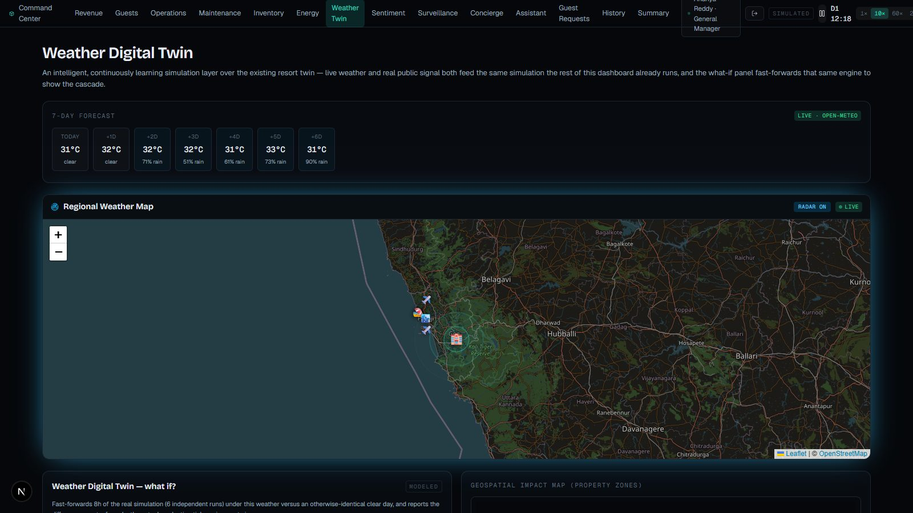
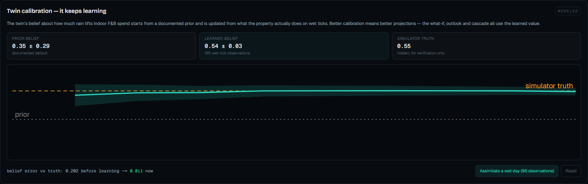
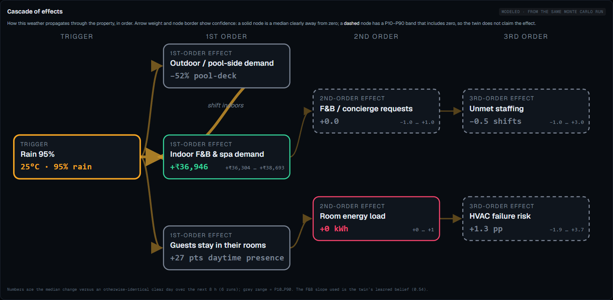
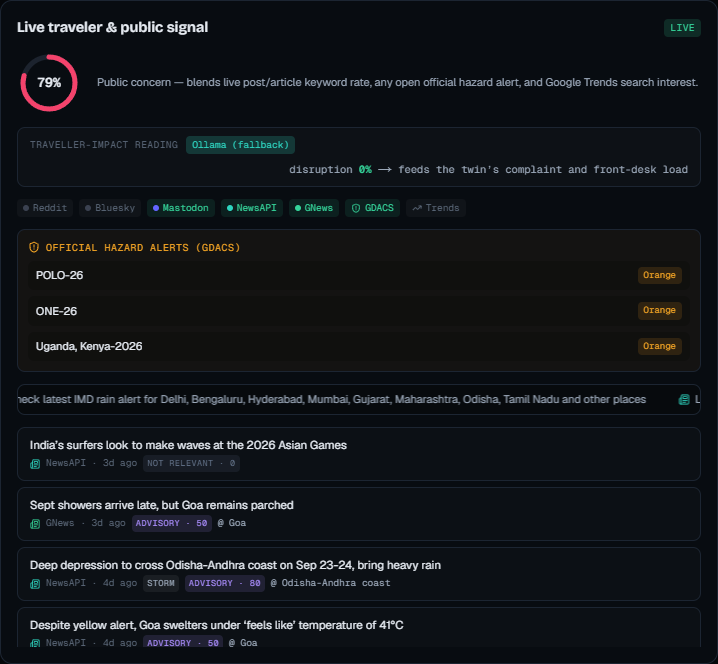
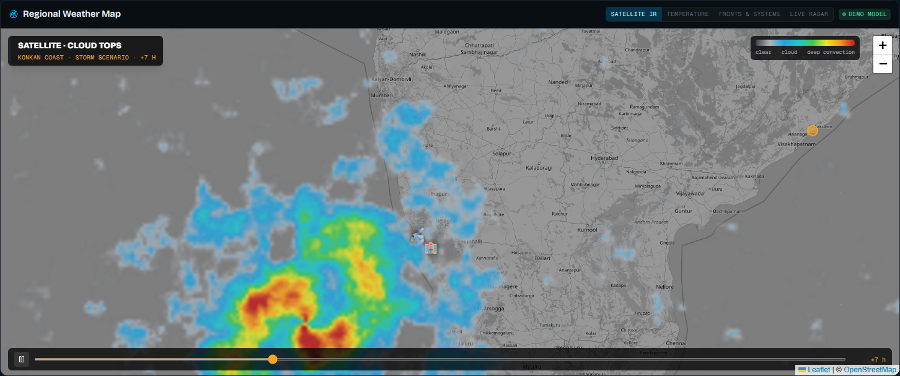
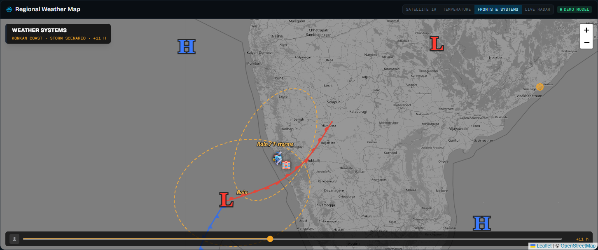

# Weather Digital Twin and Public-Signal Intelligence

A resort's demand, energy load, staffing and asset wear all move with the weather — and with what the region is saying about it. This layer feeds both into the **same simulation every other module already reads**, then lets a manager rehearse a scenario before it happens.



## 1 · Live weather drives the simulation

`app/api/weather` proxies Open-Meteo (no key, 20-minute server cache) for the property's coordinates; a seeded forecast is the fallback. [`lib/intelligence/weatherImpact.ts`](../lib/intelligence/weatherImpact.ts) is the **single weather-effect model**, read by the simulation tick, the what-if projection and the impact map:

```
Rain severity          = max(0.2, rain probability)
F&B spend multiplier   = 1 + 0.35 × severity          in-room presence  +0.28 × severity
Pool-deck demand       = 1 − 0.55 × severity          restaurant demand ×(1 + 0.30 × severity)
Heatwave severity      = clamp((temp − 34) / 6, 0.3, 1)
```

Guests sit out a storm indoors, so daytime in-room presence rises, which cascades into the existing eco-mode energy logic; heat raises chiller wear in the predictive-maintenance hazard model.

## 2 · Monte Carlo what-if — [`lib/intelligence/weatherWhatIf.ts`](../lib/intelligence/weatherWhatIf.ts)

No hand-written formula guesses at effects. The what-if **clones the live state and fast-forwards the real tick engine** for 8 hours in 30-minute steps, once under the scenario and once under an otherwise identical clear day, across 6 independent seeds. Each seed runs under both conditions, so the difference isolates the *causal* effect of the weather, not the simulation's own randomness.

```
Δmetric(run) = metric(scenario arm) − metric(clear-day arm)
band = P10 / P50 / P90 of Δ across seeds
metrics: occupancy · F&B demand · room energy · unmet staffing · HVAC risk · open F&B/concierge requests
```

The live state is never mutated (`structuredClone` per run). Six runs give a coarse band, and the UI says so. Available as an overlay in the 3D twin (weather layer with rain and heat-haze) and on `/weather-twin`.

## 3 · Public-signal concern score — [`lib/intelligence/socialSignals.ts`](../lib/intelligence/socialSignals.ts)

Seven public sources are fetched server-side behind `Promise.allSettled` so any subset can fail without breaking the feature, each reported live or unreachable individually: NewsAPI, GNews, Reddit, Bluesky, Mastodon (`#goa`, filtered to weather), GDACS (official hazard events at real coordinates) and Google Trends (search interest).

```
concern = (keyword share × 1 + hazard × 2 + trend × 1) ÷ sum of the weights actually present
hazard  = 1 if any open GDACS event in the region      readings older than 3 h are ignored
feedback into the sim: concierge request bias −0.06 × concern, complaint bias +0.04 × concern
```

An official source outweighs an anonymous post (weight 2). It is a coarse keyword-and-hazard blend, not a trained classifier, and its influence is a small nudge. The assistants also compute each hazard's **distance from the resort** — a hazard beyond ~500 km is reported as monitoring only.

## 4 · The twin keeps learning (Bayesian calibration) — [`lib/intelligence/weatherLearner.ts`](../lib/intelligence/weatherLearner.ts)

The weather-response model is not a fixed constant. The slope linking rain severity to indoor F&B spend starts from a documented prior (0.35 ± 0.15) and is updated online by conjugate normal regression from what the simulated property actually spends on wet ticks — data assimilation:

```
y = β·x + ε          x = rain severity, y = observed F&B spend ratio − 1
precision = 1/prior_sd² + Sxx/σ²        mean = (prior_mean/prior_sd² + Sxy/σ²) / precision
```

σ is estimated online from residuals. The simulator holds a **hidden true sensitivity** (seeded, 0.55–0.75× or 1.35–1.6× the prior, so learning is observable) that the twin does not know, so recovery can be verified; the Calibration card on `/weather-twin` plots the posterior mean with a 95 % band tightening as evidence arrives, against the prior and the truth. Reality ticks use the hidden truth; **what-if projections, the outlook and the assistants use the learned belief** (`wxUseBelief` on cloned states), so better calibration means better forecasts. "Assimilate a wet day" replays 96 observations from the property's real dynamics into the live twin.



## 5 · Cascade graph — [`components/analytics/CascadeGraph.tsx`](../components/analytics/CascadeGraph.tsx)

The what-if's effects ordered as a causal chain — trigger → first-order (outdoor demand falls, indoor F&B rises, guests stay in) → second-order (F&B/concierge requests, room energy) → third-order (unmet staffing, HVAC failure risk). Values are the Monte Carlo medians with P10…P90; arrow weight is signal-to-noise, and a **dashed node means the band includes zero**, so the twin declines to claim that effect.



## 6 · Reading the posts — traveller-impact intelligence — [`lib/ai/signalIntel.ts`](../lib/ai/signalIntel.ts)

Beyond a keyword score, each post or headline is classified into an intent (cancellation, delay-disruption, flooding, safety-warning, advisory, demand-shift, positive, irrelevant) with urgency and place — by the **Nugen-aligned model** when available (`POST /api/signal-intel`, cached 30 min), with a transparent rule-based classifier as fallback and gap-filler. The urgency-weighted **disruption score** nudges the simulation's complaint and front-desk load. A plain-English scenario box (`POST /api/scenario-parse`, e.g. "a severe cyclone with 95% rain") converts text to what-if parameters, clamped before the simulator sees them.



## 7 · Regional map

Four switchable layers: **Satellite IR** (cloud-top colour ramp), **Temperature** (field plus city readouts), **Fronts & systems** (L/H centres, cold and warm fronts, rain zones) and **Live radar** (RainViewer). The first three are a seeded, animated *demonstration model* — a low-pressure system drifting onto the Konkan coast, sized and tinted by the current scenario and temperature, with a play/scrub timeline — and are labelled "demo model"; only the radar layer is live. Code: `components/analytics/NewsWeatherOverlay.tsx`.





Leaflet with an OpenStreetMap base, RainViewer live radar (capped at native zoom 7), GDACS events at reported coordinates, regional airports, city and beaches, and an impact ripple paced by the current condition. If radar is unreachable the map keeps its base layer.

## Files

`app/api/weather` · `app/api/social-weather-signals` · `lib/intelligence/{weather,weatherImpact,weatherWhatIf,socialSignals}.ts` · `components/analytics/{WeatherTwinPage,RegionalWeatherMap,SocialSignalFeed,WeatherImpactMap}.tsx` · `components/command/WeatherTwinPanel.tsx` · `components/twin/WeatherFX.tsx` · `tests/intelligence/weatherWhatIf.test.ts`. Every API and its failure behaviour: [API_CATALOG.md](API_CATALOG.md).
